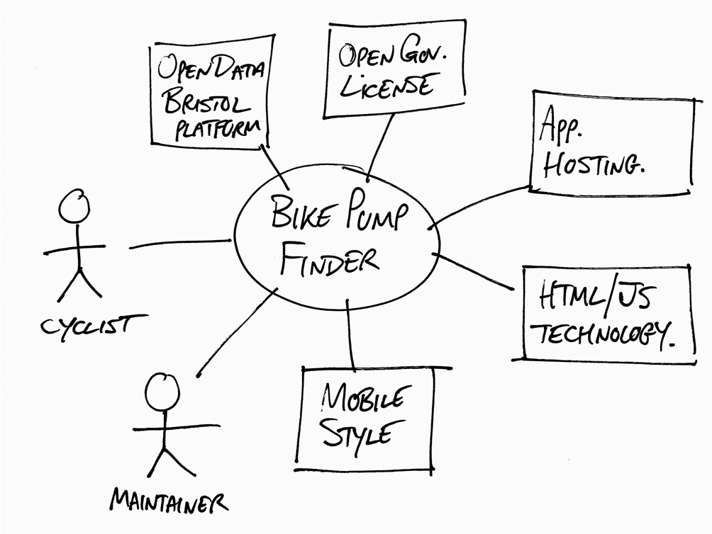

# Project Proposal

## Business Case

Problem statement

This project of creating a functional web application for car parking in Bristol using Bristol open data parking dataset is being built to tackle the fustrationg and time consuming process. With a ppopulation and the amount of car drivers that constatly growing and only going up in numbers, the demand for a easier and cheap alternative is needed. The project address the problem by building a functional and smooth web application using HTML, Javascript and CSS styling and using open data bristols API to retrieve car park data from all locations in bristol.

Business benefits

- limits time spent looking for a car park by presenting all car parks infront of you.
- Drivers are assisted with filters to search by car park type(Multi-story, Surface & Park and Ride) ect to find the correct car park for the driver.
- Supports the driver to make a better and comfortable decision in where they feel most suitable parking their car.
- Gives a clear place to store car park information(Clear display of spaces, hours and operator information)
- Uses public and free information making it free to constanlty maintain and make.
- Shows good use of the Bristol Open Data website and supports the open data initiative.
- Gelocation feature helps users to find their nearest car park. 

Options Considered

The first option was embedding google maps using the google maps API to show car park locations. As this would be a smart way to introduce a familiar and fan favourite interface and trust worthy functionality, this required an API key, might be expensive and ulitmatelty gives no control on the data. So it wasnt a good option and had not been chosen. Another option was to offer pre exisiting web applications to customers, however this wouldve reduced the effprt of development and not take advantage of the Bristol Open Data website and not meet the eductational objective of the project. Developing an application that could be used on andriod or iOS was taken into account but this had not aligned with what was asked for in the brief. 

The chosen option was to make a web application using HTML, CSS and Javascript aligns with the API from the Open Data Website. This had met the requirements of the project brief, made it less expensive and a great use of public data. 

### Expected Risks
There was a lot of potential risks that were recognised during the planning stage of the project. 

One risk is that the Bristol Open Data API could be unavailable or give false information. Although the chances of this actually happening is slim, the impact on the actual web application itself was a great risk. To lessen the risk, the correct error handling will be used on the implementation of the javascript and a user friendly error message will be displayed if the API fails to load up. 

Another risk that was found, is that the occupancy data may show up as null or a vhance of it missing could occur. This was a risk that was considered to be highly possible but with a small amount of impact of the actual functionality of the web application itself. To go around this, would be to handle the null values effortlessly and show occupancy data only when its actually available.

There is also the chances that users may deny their geolocation permissions on their devices. The risk of this is medium chance of being a risk but low impact on the web application as the functionality of the geolocation is optional. 

As well as this, theres a risk of the data set not displayong the actual car parks itself. This presents a meduim risk and medium impact risk. To adresss this roadbloc, the project scope will be clearly made to reflect that the web application itself only shows data given from the data set. 

## Project Scope
TODO: Scope of the System of Interest. Include a bullet list of things from your context diagram that are in scope.

