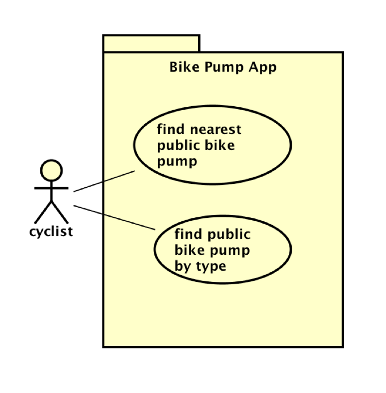

# Requirements

## User Needs

### User stories
- As a car driver, i would want to serach for car parks by name or location to find quick and secure parking in bristol.
- As a car driver, i want to find car parks in bristol by a type of filter so i can find the correct parking for my demands.
- As a car driver, i want to see how many avaliable spaces the car park has so that i can choose one with a good amount of parking spots.
- As a car driver, i want to locate a car park that minimises my walking to my actual destinanation.
- As a car driver, i want to locate the operating times of a car park so i can determine if the hours the car park is opened resonates with the times that the car is park.
- As a car driver, i want to know whether a car park has CCTV to ease any suspicions and help me feel secure in my car being kept safe.
- As a car driver, i want to see all car parks in bristol without filters so i can choose from all available options. 

### Actors
| Actor | Description |
| ----- | ----------- |
| User (Driver) | The main customer that uses the web application. A motorist driving in or around Bristol who needs to find a car park to leave their vehicle for an amount of time. They interact with the web interface via a desktop or mobile browser. |
| Bristol Open Data API | An outside platform that delivers car park data. Not a end user but interacts with the platform by responding to HTTP requests with JSON data. |
| Browser Geolocation API | An integrated browser service that retrives the user's live location when permission is granted.

### Use Cases
TODO: Describe each use case (at least one per team member).
    Give each use case a unique ID, e.g. UC1, UC2, ...
    Summarise these using the use-case template below.

| TODO: USE-CASE ID e.g. UC1, UC2, ... | TODO: USE-CASE NAME | 
| -------------------------------------- | ------------------- |
| **Description** | The users puts in a name or area into the search bar to filter the displayed car parks in real time.  |
| **Actors** | user |
| **Assumptions** | Car park information has been loaded from the API and loaded on the page. |
| **Steps** | 1. The user loads the web application. 2.The data from Bristol Open Data API. 3.User types a car park name (e.g "NCP") or area ("Clifton") into the search option. 4.The results list filters in actual time to display the right type of car park.  |
| **Variations** | If there are no matches to a car park, a "NO CAR PARKS FOUND" message is shown |
| **Non-functional** | Filtering search must update results within 100ms of each key stroke.  |
| **Issues** | None |

TODO: Your Use-Case diagram should include all use-cases.

## Software Requirements Specification
### Functional requirements
TODO: create a list of functional requirements. 
    e.g. "The system shall ..."
    Give each functional requirement a unique ID. e.g. FR1, FR2, ...
    Indicate which UC the requirement comes from.

### Non-Functional Requirements
TODO: Consider one or more [quality attributes](https://en.wikipedia.org/wiki/ISO/IEC_9126) to suggest a small number of non-functional requirements.
Give each non-functional requirement a unique ID. e.g. NFR1, NFR2, ...

Indicate which UC the requirement comes from.
